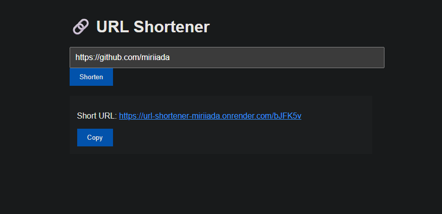

# 🔗 URL Shortener

Transform long URLs into short, shareable links.

## ✨ Features
- Instant URL shortening
- Click tracking & analytics  
- Custom short codes
- RESTful API
- QR code generation (if you added)

## 🚀 Live Demo
[Render Demo](https://url-shortener-miriiada.onrender.com/)

## 🛠️ Tech Stack
- **Backend:** Flask, Python 3.9+
- **Database:** PostgreSQL (production), SQLite (development)
- **Deployment:** Render.com
- **API:** RESTful endpoints

## 📊 API Endpoints

### Shorten URL
POST /api/shorten

### Get Stats  
GET /api/stats/:short_code

## 🖼️ Screenshots

### Site preview

## 👤 Author
[Miriiada] - [GitHub](https://github.com/miriiada)
